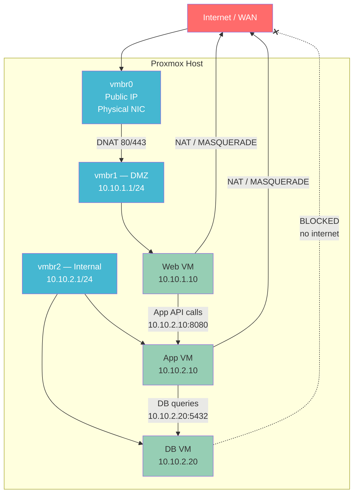

# Network Architecture — Proxmox 3-VM Setup (Web / App / DB)
*Last updated: 2026-05-28*

---

## Genel Hedef

- **Web VM** — internetten HTTP/HTTPS ile erişilebilir (DMZ)
- **App VM** — Web VM'den gelen trafiği işler, internete çıkabilir
- **DB VM** — yalnızca App VM'inden erişilebilir, dışarıya kapalı

---

## Topology (Mermaid)



### ASCII Topology (terminal referansı)

```
                    ┌───────────────────────────────────────┐
                    │           INTERNET / WAN              │
                    └──────────┬────────────────────────────┘
                               │ vmbr0 (Public IP)
                    ┌──────────▼────────────────────────────┐
                    │           Proxmox Host                │
                    │  IP forwarding ON — iptables kuralları│
                    └────┬────────────────────┬─────────────┘
                         │                   │
           ┌─────────────▼──────┐   ┌────────▼──────────────┐
           │  vmbr1 — DMZ       │   │  vmbr2 — Internal     │
           │  10.10.1.0/24      │   │  10.10.2.0/24         │
           └────────┬───────────┘   └────────┬──────┬───────┘
                    │                        │      │
              ┌─────▼──────┐         ┌───────▼─┐  ┌▼──────────┐
              │  Web VM    │         │ App VM  │  │  DB VM    │
              │ 10.10.1.10 │─────────│10.10.2.10│  │10.10.2.20 │
              │ Port 80/443│  API    │Port 8080│  │Port 5432  │
              └────────────┘         └─────────┘  └───────────┘
```

---

## Subnets

| Network  | CIDR          | Bridge | Gateway    | Purpose                              |
|----------|---------------|--------|------------|--------------------------------------|
| DMZ      | 10.10.1.0/24  | vmbr1  | 10.10.1.1  | İnternete açık web servisleri        |
| Internal | 10.10.2.0/24  | vmbr2  | 10.10.2.1  | App + DB — izole iç ağ              |

### VM IP Atamaları

| VM      | Subnet   | IP Address  | Bridge | Rol                    |
|---------|----------|-------------|--------|------------------------|
| Web VM  | DMZ      | 10.10.1.10  | vmbr1  | Nginx / frontend       |
| App VM  | Internal | 10.10.2.10  | vmbr2  | Uygulama sunucusu      |
| DB VM   | Internal | 10.10.2.20  | vmbr2  | PostgreSQL / MySQL     |

> **Not:** Web VM yalnızca vmbr1'de. App ve DB yalnızca vmbr2'de.
> Web → App erişimi için Web VM'ine ek olarak vmbr2 bağlamak GEREKMEZ —
> bu trafiği Proxmox host'u üzerinden yönlendiriyoruz.

---

## Traffic Policy

| Source            | Destination       | Port(s)   | Action          | Kural                     |
|-------------------|-------------------|-----------|-----------------|---------------------------|
| Internet          | Web VM            | 80, 443   | ALLOW (DNAT)    | PREROUTING DNAT           |
| Web VM            | App VM            | 8080      | ALLOW           | FORWARD ACCEPT            |
| App VM            | DB VM             | 5432      | ALLOW           | FORWARD ACCEPT            |
| Internet          | DB VM             | *         | DENY            | FORWARD DROP (default)    |
| Internet          | App VM            | *         | DENY            | FORWARD DROP (default)    |
| Web VM            | Internet          | *         | ALLOW (NAT)     | MASQUERADE via vmbr0      |
| App VM            | Internet          | *         | ALLOW (NAT)     | MASQUERADE via vmbr0      |
| DB VM             | Internet          | *         | DENY            | no FORWARD rule, DROP     |
| DMZ (10.10.1.0/24)| Internal (10.10.2.0/24) | * | DENY (default) | FORWARD DROP             |

---

## Proxmox Host — /etc/network/interfaces

```bash
# /etc/network/interfaces

# vmbr0 — WAN / Public NIC (mevcut config'in üstüne ekleme yapın)
auto vmbr0
iface vmbr0 inet static
    address <PUBLIC_IP>/24
    gateway <UPSTREAM_GATEWAY>
    bridge-ports enp3s0        # gerçek NIC adınızla değiştirin
    bridge-stp off
    bridge-fd 0

# vmbr1 — DMZ bridge (Web VM)
auto vmbr1
iface vmbr1 inet static
    address 10.10.1.1/24
    bridge-ports none
    bridge-stp off
    bridge-fd 0
    post-up   echo 1 > /proc/sys/net/ipv4/ip_forward
    # Web VM'in internete çıkışı için NAT
    post-up   iptables -t nat -A POSTROUTING -s 10.10.1.0/24 -o vmbr0 -j MASQUERADE
    post-down iptables -t nat -D POSTROUTING -s 10.10.1.0/24 -o vmbr0 -j MASQUERADE
    # İnternetten Web VM'e port yönlendirme
    post-up   iptables -t nat -A PREROUTING -i vmbr0 -p tcp --dport 80  -j DNAT --to-destination 10.10.1.10:80
    post-up   iptables -t nat -A PREROUTING -i vmbr0 -p tcp --dport 443 -j DNAT --to-destination 10.10.1.10:443
    post-down iptables -t nat -D PREROUTING -i vmbr0 -p tcp --dport 80  -j DNAT --to-destination 10.10.1.10:80
    post-down iptables -t nat -D PREROUTING -i vmbr0 -p tcp --dport 443 -j DNAT --to-destination 10.10.1.10:443

# vmbr2 — Internal bridge (App + DB VM)
auto vmbr2
iface vmbr2 inet static
    address 10.10.2.1/24
    bridge-ports none
    bridge-stp off
    bridge-fd 0
    # App VM'in internete çıkışı için NAT
    post-up   iptables -t nat -A POSTROUTING -s 10.10.2.0/24 -o vmbr0 -j MASQUERADE
    post-down iptables -t nat -D POSTROUTING -s 10.10.2.0/24 -o vmbr0 -j MASQUERADE
```

---

## iptables Kuralları

Tüm kuralları tek bir script olarak uygulayın. Önce rollback komutlarını hazır edin.

### Rollback (acil durum için her zaman hazır bulundurun)

```bash
#!/bin/bash
# rollback.sh — tüm kuralları sıfırlar, her şeye izin verir
sudo iptables -F
sudo iptables -t nat -F
sudo iptables -t mangle -F
sudo iptables -X
sudo iptables -P INPUT   ACCEPT
sudo iptables -P FORWARD ACCEPT
sudo iptables -P OUTPUT  ACCEPT
echo "Rollback tamamlandi. Tum kurallar temizlendi."
```

### Ana Kural Seti — netarch-setup.sh

```bash
#!/bin/bash
# netarch-setup.sh
# Proxmox 3-VM: Web (DMZ) + App + DB (Internal)
# ÖNCE rollback.sh'ı hazır edin!
set -euo pipefail

echo "[1/6] IP forwarding aktif ediliyor..."
echo 1 > /proc/sys/net/ipv4/ip_forward
# Reboot'ta kalıcı olması için:
grep -q 'net.ipv4.ip_forward' /etc/sysctl.conf \
  && sed -i 's/.*net.ipv4.ip_forward.*/net.ipv4.ip_forward = 1/' /etc/sysctl.conf \
  || echo 'net.ipv4.ip_forward = 1' >> /etc/sysctl.conf

echo "[2/6] Mevcut kurallar temizleniyor..."
iptables -F
iptables -t nat -F
iptables -X

echo "[3/6] Temel INPUT kuralları (host koruması)..."
# Kurulu bağlantılar
iptables -A INPUT -m state --state ESTABLISHED,RELATED -j ACCEPT
# Loopback
iptables -A INPUT -i lo -j ACCEPT
# SSH (host'a erişim kesilmesin)
iptables -A INPUT -p tcp --dport 22 -j ACCEPT
# ICMP (ping)
iptables -A INPUT -p icmp -j ACCEPT
# Proxmox web UI (8006) — gerekirse kapatın
iptables -A INPUT -p tcp --dport 8006 -j ACCEPT
# INPUT policy
iptables -P INPUT DROP

echo "[4/6] FORWARD kuralları..."
# Kurulu bağlantılar (stateful — bu olmazsa hiçbir şey çalışmaz)
iptables -A FORWARD -m state --state ESTABLISHED,RELATED -j ACCEPT

# [ALLOW] Web VM → App VM (port 8080 — uygulama API)
iptables -A FORWARD -s 10.10.1.10 -d 10.10.2.10 -p tcp --dport 8080 -j ACCEPT

# [ALLOW] App VM → DB VM (port 5432 — PostgreSQL)
iptables -A FORWARD -s 10.10.2.10 -d 10.10.2.20 -p tcp --dport 5432 -j ACCEPT

# [ALLOW] Web VM → internet (NAT ile)
iptables -A FORWARD -s 10.10.1.0/24 -o vmbr0 -j ACCEPT

# [ALLOW] App VM → internet (NAT ile) — SADECE App VM (10.10.2.10), DB değil
iptables -A FORWARD -s 10.10.2.10 -o vmbr0 -j ACCEPT

# [ALLOW] DNAT ile yönlendirilen trafiğin Web VM'e ulaşması
iptables -A FORWARD -d 10.10.1.10 -p tcp -m multiport --dports 80,443 -j ACCEPT

# [DENY] DB VM'in internete çıkması engelleniyor
iptables -A FORWARD -s 10.10.2.20 -o vmbr0 -j DROP

# [DENY] DMZ'den Internal'e genel erişim engelleniyor
iptables -A FORWARD -s 10.10.1.0/24 -d 10.10.2.0/24 -j DROP

# [DENY] Internet'ten doğrudan App veya DB'ye erişim engelleniyor
iptables -A FORWARD -i vmbr0 -d 10.10.2.0/24 -j DROP

# Default FORWARD policy
iptables -P FORWARD DROP

echo "[5/6] NAT kuralları (MASQUERADE + DNAT)..."
# Web VM internete çıkışı
iptables -t nat -A POSTROUTING -s 10.10.1.0/24 -o vmbr0 -j MASQUERADE

# App VM internete çıkışı (sadece App VM, DB değil)
iptables -t nat -A POSTROUTING -s 10.10.2.10 -o vmbr0 -j MASQUERADE

# İnternetten Web VM'e port yönlendirme
iptables -t nat -A PREROUTING -i vmbr0 -p tcp --dport 80  -j DNAT --to-destination 10.10.1.10:80
iptables -t nat -A PREROUTING -i vmbr0 -p tcp --dport 443 -j DNAT --to-destination 10.10.1.10:443

echo "[6/6] Kurallar kaydediliyor..."
apt-get install -y iptables-persistent 2>/dev/null || true
iptables-save > /etc/iptables/rules.v4
netfilter-persistent save 2>/dev/null || true

echo ""
echo "=== TAMAMLANDI ==="
echo "Dogrulama icin: iptables -L -n -v --line-numbers"
echo "NAT tablosu: iptables -t nat -L -n -v"
```

---

## VM Ağ Konfigürasyonu

### Web VM (10.10.1.10) — Proxmox GUI'de

Proxmox GUI → VM → Hardware → Network Device:
- **Bridge:** vmbr1
- **Model:** VirtIO (önerilen)

VM içinde (`/etc/network/interfaces` veya Netplan):

```bash
# Debian/Ubuntu — /etc/network/interfaces
auto eth0
iface eth0 inet static
    address 10.10.1.10/24
    gateway 10.10.1.1
    dns-nameservers 1.1.1.1 8.8.8.8
```

### App VM (10.10.2.10) — Proxmox GUI'de

- **Bridge:** vmbr2

```bash
auto eth0
iface eth0 inet static
    address 10.10.2.10/24
    gateway 10.10.2.1
    dns-nameservers 1.1.1.1 8.8.8.8
```

### DB VM (10.10.2.20) — Proxmox GUI'de

- **Bridge:** vmbr2

```bash
auto eth0
iface eth0 inet static
    address 10.10.2.20/24
    gateway 10.10.2.1      # gateway var ama FORWARD kuralı yok, internet yok
    dns-nameservers 1.1.1.1 8.8.8.8
```

---

## Uygulama Adımları

### [CONFIG CHANGE] 1. /etc/network/interfaces güncelle

```bash
# Proxmox host SSH erişimi
ssh root@<PROXMOX_IP>

# Mevcut config'i yedekle
cp /etc/network/interfaces /etc/network/interfaces.bak.$(date +%Y%m%d)

# Config'i düzenle (yukarıdaki vmbr1/vmbr2 bloklarını ekle)
nano /etc/network/interfaces
```

### [NETWORK CHANGE] 2. Bridge'leri etkinleştir

```bash
# ifreload ile uygula (VM'lere bağlantı kesilmeyebilir, vmbr0 değişmiyorsa güvenli)
sudo ifreload -a

# Sonra doğrula
ip addr show vmbr1
ip addr show vmbr2
```

### [NETWORK CHANGE] 3. iptables scriptini çalıştır

```bash
# Scripti oluştur
cat > /tmp/netarch-setup.sh << 'SCRIPT'
[yukarıdaki script içeriği]
SCRIPT

chmod +x /tmp/netarch-setup.sh

# ÖNCE rollback'i test et, SONRA setup'ı uygula
bash /tmp/netarch-setup.sh
```

### [READ-ONLY] 4. Doğrulama

```bash
# Tüm kuralları göster
iptables -L -n -v --line-numbers
iptables -t nat -L -n -v

# Bridge'leri kontrol et
brctl show

# IP forwarding açık mı?
cat /proc/sys/net/ipv4/ip_forward   # 1 çıkmalı

# Web VM'den internet testi (Web VM içinde)
ping -c 3 8.8.8.8

# App VM'den internet testi (App VM içinde)
ping -c 3 8.8.8.8

# DB VM'den internet testi — bu BAŞARILI OLMAMALI
ping -c 3 8.8.8.8   # timeout bekleniyor

# App VM'den DB'ye bağlantı testi
nc -zv 10.10.2.20 5432

# Web VM'den App VM'e bağlantı testi
nc -zv 10.10.2.10 8080
```

---

## Applied Changes

| Tarih | Değişiklik | Risk |
|-------|-----------|------|
| 2026-05-28 | İlk tasarım oluşturuldu | — |

---

## Rollback

```bash
# Acil durum: tüm kuralları sıfırla, her şeye izin ver
sudo iptables -F
sudo iptables -t nat -F
sudo iptables -t mangle -F
sudo iptables -X
sudo iptables -P INPUT   ACCEPT
sudo iptables -P FORWARD ACCEPT
sudo iptables -P OUTPUT  ACCEPT

# Kayıtlı önceki kuralları geri yükle (varsa)
sudo iptables-restore < /etc/iptables/rules.v4.bak

# /etc/network/interfaces yedeğini geri al
sudo cp /etc/network/interfaces.bak.<TARİH> /etc/network/interfaces
sudo ifreload -a
```
