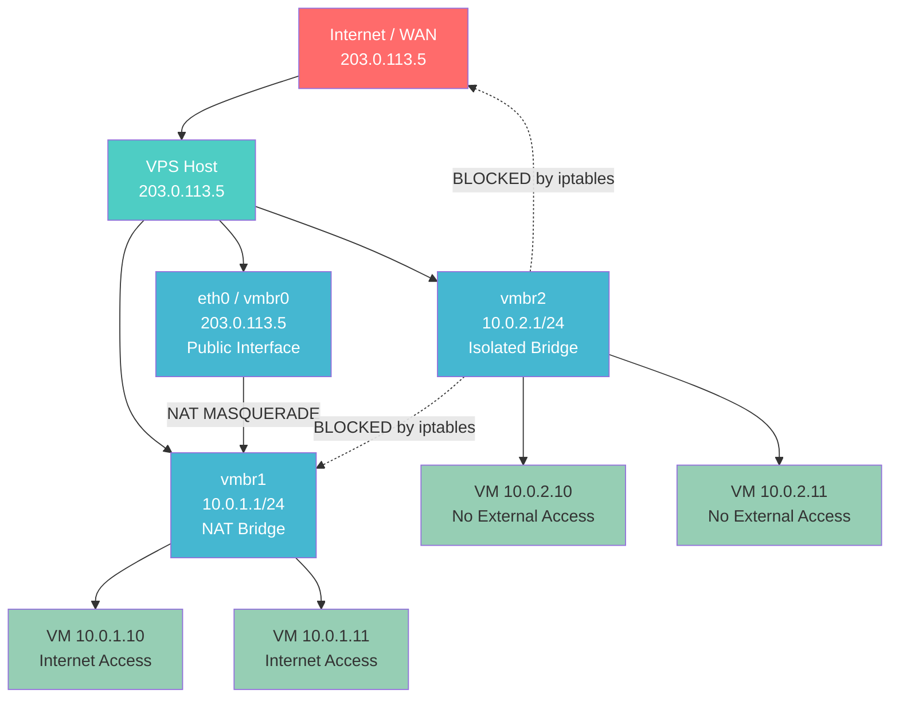

# Network Architecture — VPS Dual Subnet
*Last updated: 2026-05-28*

## Overview

Bu VPS kurulumunda iki izole subnet bulunmaktadır:

- **10.0.1.0/24** — NAT Bridge: VM'ler bu subnet üzerinden internete çıkabilir
- **10.0.2.0/24** — Isolated Bridge: Tamamen izole, ne internete ne de dışarıya erişim yok

Host: `203.0.113.5` — Tek public IP, SSH erişim noktası.

---

## Topology



### ASCII Topology (terminal-friendly)

```
┌──────────────────────────────────────────────────────┐
│               INTERNET / WAN                         │
│           Public IP: 203.0.113.5                     │
└──────────────────────┬───────────────────────────────┘
                       │
               ┌───────▼────────┐
               │   VPS Host     │
               │  203.0.113.5   │
               │  (eth0/vmbr0)  │
               └──┬──────────┬──┘
                  │          │
     ┌────────────▼──┐  ┌────▼─────────────┐
     │  vmbr1 (NAT)  │  │  vmbr2 (ISOLATED)│
     │  10.0.1.1/24  │  │  10.0.2.1/24     │
     │  NAT->Internet│  │  NO EXTERNAL     │
     └──┬────────────┘  └──┬───────────────┘
        │                  │
   [VM 10.0.1.x]      [VM 10.0.2.x]
   Internet: YES       Internet: NO
   Isolated: NO        Isolated: YES
```

---

## Subnets

| Network | CIDR | Bridge | Gateway | Purpose | Internet |
|---------|------|--------|---------|---------|----------|
| NAT Subnet | 10.0.1.0/24 | vmbr1 | 10.0.1.1 | VM'ler internete çıkabilir (NAT) | YES |
| Isolated Subnet | 10.0.2.0/24 | vmbr2 | 10.0.2.1 | Tamamen izole, dış erişim yok | NO |

---

## Traffic Policy

| Source | Destination | Action | Mechanism |
|--------|-------------|--------|-----------|
| 10.0.1.0/24 | Internet | ALLOW | NAT MASQUERADE via vmbr0 |
| 10.0.2.0/24 | Internet | DENY | iptables FORWARD DROP |
| 10.0.2.0/24 | 10.0.1.0/24 | DENY | iptables FORWARD DROP |
| 10.0.1.0/24 | 10.0.2.0/24 | DENY | iptables FORWARD DROP |
| Internet | 10.0.2.0/24 | DENY | No route + iptables DROP |
| Internet | 10.0.1.0/24 (new) | DENY | iptables FORWARD (stateful) |
| SSH (any) | Host :22 | ALLOW | iptables INPUT ACCEPT |
| ESTABLISHED | Any | ALLOW | iptables state tracking |

---

## Bridge Configuration

### vmbr1 — NAT Bridge (10.0.1.0/24)

```
auto vmbr1
iface vmbr1 inet static
    address 10.0.1.1/24
    bridge-ports none
    bridge-stp off
    bridge-fd 0
    post-up   echo 1 > /proc/sys/net/ipv4/ip_forward
    post-up   iptables -t nat -A POSTROUTING -s '10.0.1.0/24' -o eth0 -j MASQUERADE
    post-down iptables -t nat -D POSTROUTING -s '10.0.1.0/24' -o eth0 -j MASQUERADE
```

### vmbr2 — Isolated Bridge (10.0.2.0/24)

```
auto vmbr2
iface vmbr2 inet static
    address 10.0.2.1/24
    bridge-ports none
    bridge-stp off
    bridge-fd 0
```

No post-up NAT or routing hooks — this bridge is intentionally air-gapped from the internet.

---

## iptables Rules Summary

```bash
# --- INPUT chain: protect the host ---
iptables -A INPUT -m state --state ESTABLISHED,RELATED -j ACCEPT
iptables -A INPUT -i lo -j ACCEPT
iptables -A INPUT -p tcp --dport 22 -j ACCEPT          # SSH — MUST come before DROP
iptables -A INPUT -p icmp -j ACCEPT                    # ping for diagnostics
iptables -P INPUT DROP

# --- FORWARD chain: control subnet routing ---
iptables -A FORWARD -m state --state ESTABLISHED,RELATED -j ACCEPT

# NAT subnet: allow outbound to internet
iptables -A FORWARD -s 10.0.1.0/24 -o eth0 -j ACCEPT

# Isolated subnet: BLOCK all forwarding (no internet, no cross-subnet)
iptables -A FORWARD -s 10.0.2.0/24 -j DROP
iptables -A FORWARD -d 10.0.2.0/24 -j DROP

# Cross-subnet: block NAT subnet from reaching isolated subnet
iptables -A FORWARD -s 10.0.1.0/24 -d 10.0.2.0/24 -j DROP

iptables -P FORWARD DROP

# --- NAT table: masquerade for 10.0.1.0/24 ---
iptables -t nat -A POSTROUTING -s 10.0.1.0/24 -o eth0 -j MASQUERADE
```

---

## VM Network Configuration Examples

### VM on 10.0.1.0/24 (internet access)

```
# /etc/network/interfaces (inside the VM)
auto eth0
iface eth0 inet static
    address 10.0.1.10/24
    gateway 10.0.1.1
    dns-nameservers 1.1.1.1 8.8.8.8
```

### VM on 10.0.2.0/24 (isolated)

```
# /etc/network/interfaces (inside the VM)
auto eth0
iface eth0 inet static
    address 10.0.2.10/24
    gateway 10.0.2.1
    # No DNS needed — no external access
```

---

## Verification Commands

```bash
# 1. Check bridges are up with correct IPs
ip addr show vmbr1
ip addr show vmbr2

# 2. Check IP forwarding is enabled (for NAT subnet)
cat /proc/sys/net/ipv4/ip_forward
# Expected: 1

# 3. Check all iptables rules
sudo iptables -L -n -v --line-numbers
sudo iptables -t nat -L -n -v

# 4. From a VM on 10.0.1.x — should succeed
ping -c 3 8.8.8.8
curl -s --max-time 5 http://example.com

# 5. From a VM on 10.0.2.x — should FAIL (timeout)
ping -c 3 8.8.8.8        # expected: 100% packet loss
curl -s --max-time 5 http://example.com  # expected: timeout

# 6. From 10.0.2.x to 10.0.1.x — should FAIL
ping -c 3 10.0.1.10      # expected: 100% packet loss

# 7. Full diagnostic snapshot
ip addr show && echo '---' && ip route show && echo '---' && sudo iptables -L FORWARD -n -v
```

---

## Applied Changes

| Timestamp | Change | Risk |
|-----------|--------|------|
| 2026-05-28 | Initial design created | - |
| (pending) | vmbr1 NAT bridge added | [CONFIG CHANGE] |
| (pending) | vmbr2 isolated bridge added | [CONFIG CHANGE] |
| (pending) | iptables ruleset applied | [NETWORK CHANGE] |
| (pending) | iptables-persistent installed | [CONFIG CHANGE] |

---

## Rollback

```bash
# Emergency: remove all rules, allow everything
sudo iptables -F
sudo iptables -t nat -F
sudo iptables -t mangle -F
sudo iptables -X
sudo iptables -P INPUT ACCEPT
sudo iptables -P FORWARD ACCEPT
sudo iptables -P OUTPUT ACCEPT

# Remove bridges (if networking restart needed)
sudo ip link set vmbr1 down
sudo ip link set vmbr2 down
sudo brctl delbr vmbr1
sudo brctl delbr vmbr2
```

**Always run the rollback script first if SSH becomes unreachable.**
